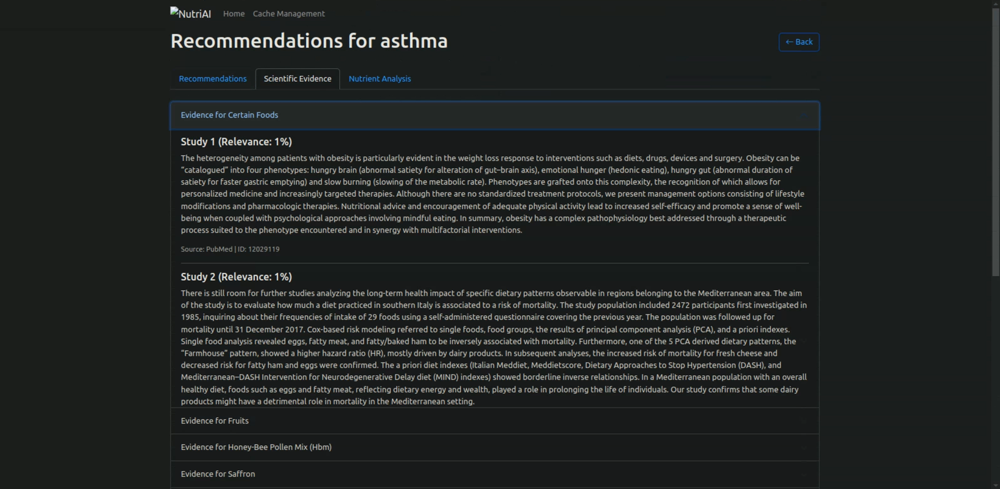

# NutriAI: Personalized Nutrition Recommendation System

## 🧠 Problem Statement
Healthcare professionals and individuals often struggle to find evidence-based nutritional recommendations for specific health conditions. The challenge lies in connecting vast amounts of scientific literature, nutritional data, and medical knowledge to provide personalized, scientifically-backed dietary guidance. Traditional approaches often miss novel food-disease relationships and lack clear explanations for their recommendations.

## 🧪 Approach & Solution
NutriAI tackles this challenge through a multi-modal AI approach:
- **Knowledge Graph (KG)** represents structured relationships between foods and diseases
- **Graph Neural Network (GNN)** learns patterns to predict novel food-disease relationships
- **RAG Pipeline** using biomedical embeddings (PubMedBERT) and FAISS for scientific evidence retrieval
- **LLM Integration** with Groq's LLama-3-70B for natural language explanations
- **Reinforcement Learning Cache** system for optimizing response times
- **Interactive Network Visualization** for relationship exploration

## 🚀 Features
- 🎯 Evidence-based food recommendations for specific health conditions
- 📚 Scientific literature backing for each recommendation
- 🔮 Novel food-disease relationship predictions using GNN
- 💡 Concise, scientifically-grounded explanations via LLM
- 📊 Interactive network visualizations of food-disease relationships
- ⚡ Smart caching system using reinforcement learning
- 🔍 Biomedical literature search with domain-specific embeddings

## 🛠️ Tech Stack
- **Backend Framework**: Flask
- **ML/DL Frameworks**: 
  - PyTorch
  - PyTorch Geometric
  - FAISS
  - NetworkX
- **Language Models**: 
  - Groq LLama-3-70B
  - microsoft/BiomedNLP-PubMedBERT
- **Vector Search**: FAISS
- **Graph Processing**: NetworkX
- **Caching**: Custom RL-based system
- **Visualization**: Network graph visualization library

## 📸 Screenshots & Demo

🎥 **Demo Video**
[Watch Demo Video](./assets/demo.mp4)
*Full demonstration of the NutriAI system in action*

### Interface Screenshots


*Intuitive interface for selecting health conditions and initiating recommendations*


*Overview of personalized food recommendations for selected conditions*


*In-depth view of recommendations with nutritional information and rationale*


*Scientific literature and evidence supporting each recommendation*


*System performance metrics showing the effectiveness of the RL-based caching system*

## ▶️ Run Instructions

### 1. Environment Setup
```bash
# Clone the repository
git clone https://github.com/Adarshh9/Nutri-AI
cd NutriAI

# Create and activate virtual environment
python -m venv venv
source venv/bin/activate  # On Windows: .\venv\Scripts\activate
```

### 2. Install Dependencies
```bash
pip install -r requirements.txt
```

### 3. Configure Environment Variables
Create a `.env` file in the root directory:
```env
GROQ_API_KEY=your_groq_api_key
```

### 4. Run the Application
```bash
python core/app.py
```

The application will be available at `http://localhost:5000`

### 5. Using the Interface
1. Access the web interface through your browser
2. Select or enter a health condition
3. View recommended foods with scientific evidence
4. Explore the knowledge graph visualization
5. Access detailed explanations for each recommendation

⚠️ **Important Notes**:
- Ensure you have sufficient RAM (recommended: 16GB+) for running the models
- The first run will download required model weights
- Cache system will optimize performance over time
- For optimal performance, use a GPU-enabled machine
